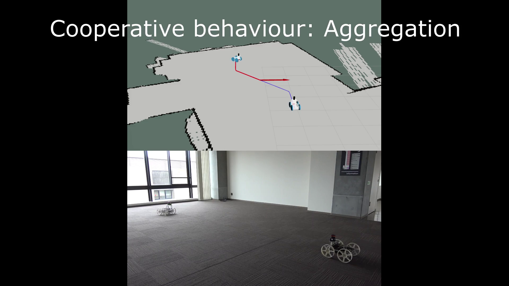

# cooperative_robots
## Repository containing packages for an actual system of cooperative robots

This repository contains packages required to implement Autonomous Navigation and Cooperative Behaviour on two skid-steering configuration robots.
The used hardware consists of a Jetson Nano communicating through rosserial with an Arduino (that takes care of motors control and encoders signals).
The two robots share the same configuration and they are remotly operated from a workstation (PC) where it is also possible to visualize the environment where the robots are moving.
From the workstation, it is possible to run two nodes, "aggregation" and "follow" that provide two examples of basic cooperative behaviour functions.

More detailed information are given within the packages.

